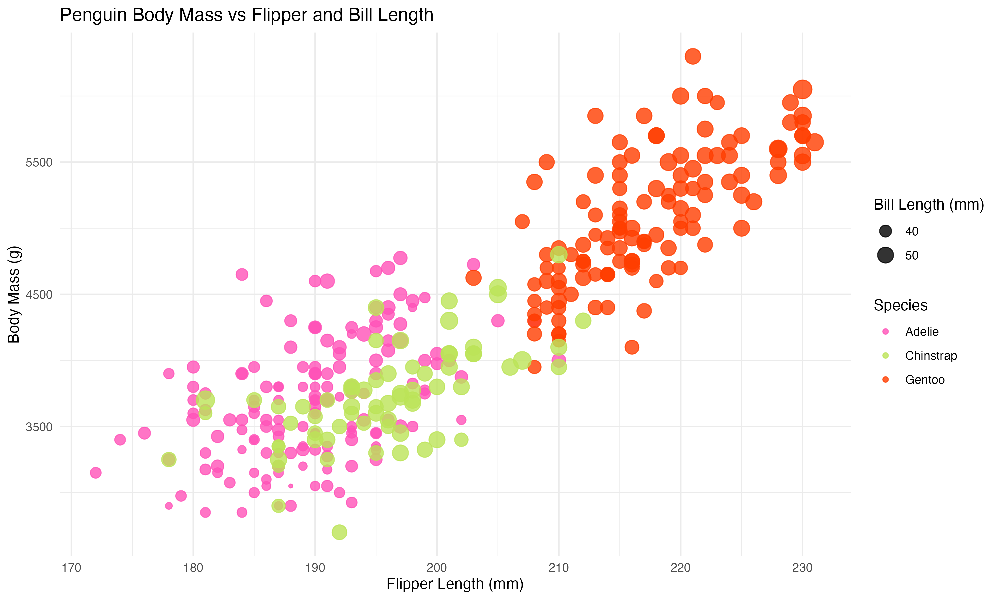
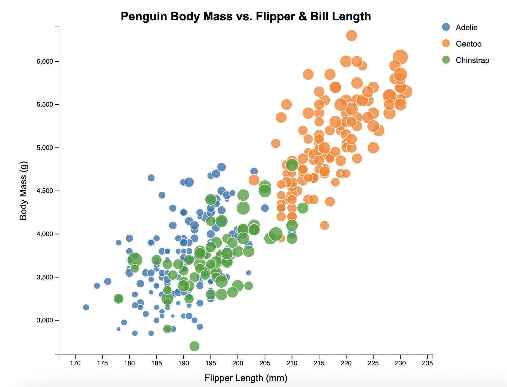
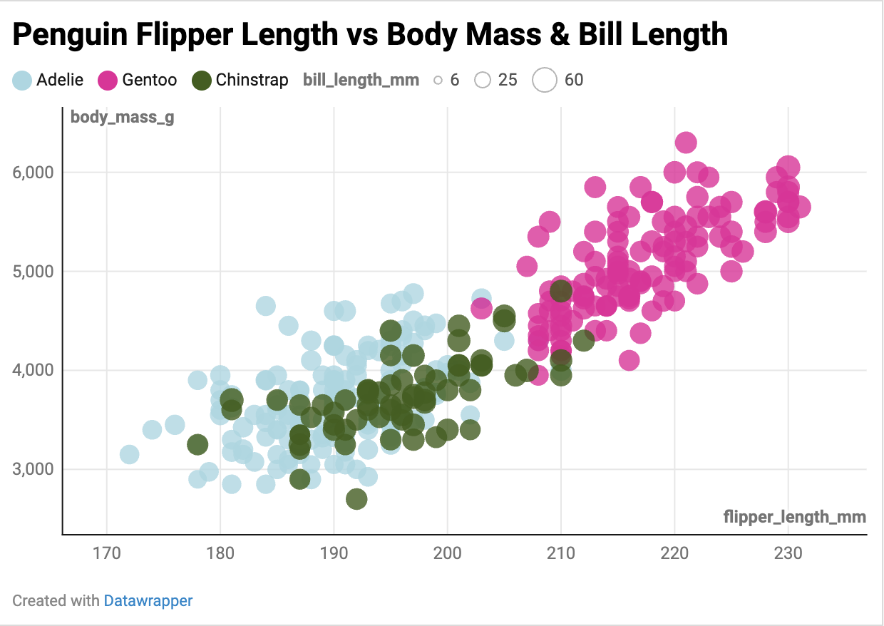
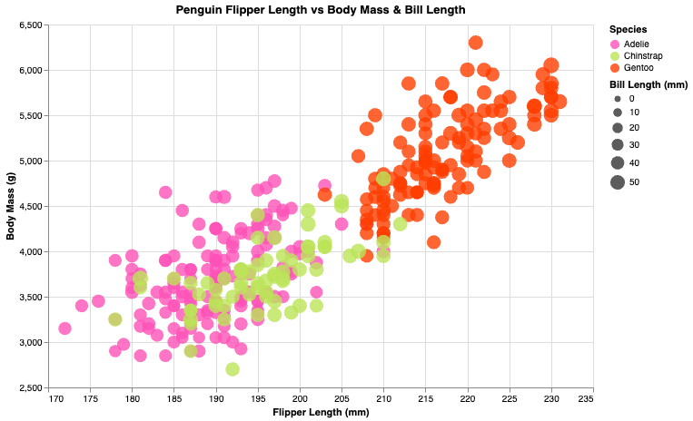

# R + ggplot2 

R is a language primarily focused on statistical computing.
ggplot2 is a popular library for charting in R.
I utilized online documentation to get started with creating a visualization using ggplot2 and `geom_point()`. 
To assist with more granular adjustments, I used Claude to help with syntax. 
I was able to play around with the colors to make the chart more visually appealing, and overall thought this library was easy to use and manipulate.

# d3
D3 is JavaScript library for data visualization.
It is widely popular across any industry that requires data visualization, such as journalism, academia, and data analytics.
I used online documentation to get started with setting-up my code and also used generative AI to make some refinements.
I liked how I was able to distinguish between the different bill length sizes through the dots, but had a hard time figuring out how to add a legend (which was a recurring problem with other libraries as well).
While the other tools also allowed you to scale the dots based on bill length size, I thought this was one of the few tools that made the size differences distinguishable to the naked eye.

# DataWrapper
DataWrapper is an online data visualization platform that doesn't require programming.
It reminded me of a slightly more intuitive Tableau. 
I thought it was fairly easy to use and there was almost no learning curve which was nice.
While I was able to adjust the dot size by bill length, I felt like it was hard to create a visible difference between the different dot sizes. 
Unless you were familiar with the specific dimensions of the data, it would be difficult for an average reader to understand the differences in bill length.
There also wasn't an option to customize axis titles, which I think is a relatively standard feature that should be available on a data visualization platform. 

# Flourish
Flourish is another online data visualization platform that was pretty similar to DataWrapper. I think it's kind of like comparing Google Docs to Microsoft Word– same idea just a slightly different packaging + interface. 
It was a pretty intuitive tool and I didn't have a hard time figuring it out.
Unlike DataWrapper, I was unable to adjust dot size based on bill length. I suspect that's a feature that is only unlocked if you pay for a more premuim version of the tool.
While I was able to edit axis labels, I wasn't able to add a title to my chart, which I thought was odd, I feel like that's a pretty standard feature for a data visualization tool. 
Overall I thought both DataWrapper and Flourish are fine for creating a quick visual, especially if you have very little programming experience, but if you have the time/energy then a library like d3 or Altair will create a more nuanced and better quality visual.

# Altair
Saved the best for last! Vega-Altair is a python data visualization library, and it was by far my favorite tool to use.
I thought it was pretty easy to grasp and making changes to my chart was pretty intuitive. 
I was also able to add an interactive feature where hovering over each data point showed additional details about the penguin. 
Furthermore, I enjoyed being able to add a legend for bill length, even though the difference between sized dots wasn't super obvious.
For future data visualization projects, I would definitely choose to reuse Altair, as I had an overwhelmingly positive experience using this tool. 
To help with syntax, I started with online documentation and used Claude for small refinements, but once again the library is pretty intuitive so it was relatively easy to figure out.

## Technical Achievements
- Created mostly consistent visualizations across 5 different tools, 3 of them being programming libraries.

### Design Achievements
- Played around with colors and spacing to create visually-appealing charts.
- While I wasn't able to reproduce the exact same chart in each tool, I tried to keep each chart relatively consistent and easy-to-understand.

